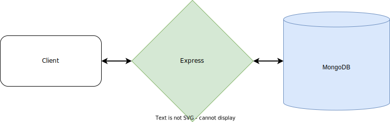

# About
This project is a full-stack invoice application. It was build using `MEAN` (MongoDB, Express, Angular, Node) stack.
If you are interested in the API, you can find it by this [link](https://github.com/Glattoni/invoice-app-api).

## Getting started
_Note: If you are a firefox user, you might need to set this flag `layout.css.has-selector.enabled` to true as `:has` pseudo-selector has not yet been enabled by default._

You will need to have Node installed. You can get it by visiting https://nodejs.org or by using any of the node version managers. It is recommended to use [fnm](https://github.com/Schniz/fnm).

## Architecture

  

